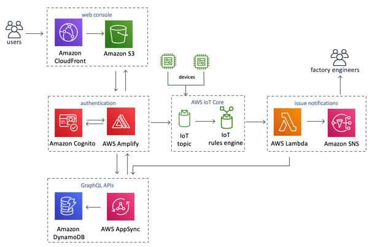

# Amazon Virtual Andon Solution
Amazon Virtual Andon is a self-service, cloud based andon system that makes it easy for
any business to deploy andon in their factory. It is based on the same technology used
by the Amazon Fulfillment centers built on AWS.

The events occurring on the factory floor are captured either using a web-interface or connecting the machines to AWS IoT core that publish the events to a topic. These events are then stored in Dynamo DB. Using the IoT Rule Engine, the events are integrated with other AWS services such as SNS to send notifications about the events
and Amazon Sagemaker for machine learning.

The solution comes with 4 different user personas, Admin, Manager, Engineer and Associate.

For more information and a detailed deployment guide visit the Amazon Virtual Andon solution at https://aws.amazon.com/solutions/amazon-virtual-andon/.

## Architecture Overview


## Running unit tests for customization
* Clone the repository, then make the desired code changes
* Next, run unit tests to make sure added customization passes the tests
```bash
cd ./deployment
chmod +x ./run-unit-tests.sh
./run-unit-tests.sh
```

## Building distributable for customization
* Configure the bucket name of your target Amazon S3 distribution bucket
```
export DIST_OUTPUT_BUCKET=my-bucket-name # bucket where customized code will reside
export VERSION=my-version # version number for the customized code
```
_Note:_ You would have to create an S3 bucket with the prefix 'my-bucket-name-<aws_region>'; aws_region is where you are testing the customized solution. Also, the assets in bucket should be publicly accessible.

* Now build the distributable:
```bash
chmod +x ./build-s3-dist.sh
./build-s3-dist.sh $DIST_OUTPUT_BUCKET $SOLUTION_NAME $VERSION
```

* Deploy the distributable to an Amazon S3 bucket in your account. _Note:_ you must have the AWS Command Line Interface installed.
```bash
aws s3 cp ./regional-s3-assets/ s3://my-bucket-name-<aws_region>/amazon-virtual-andon/<my-version>/ --recursive --acl bucket-owner-full-control --profile aws-cred-profile-name
```

* Get the link of the amazon-virtual-andon.template uploaded to your Amazon S3 bucket.
* Deploy the Amazon Virtual Andon solution to your account by launching a new AWS CloudFormation stack using the link of the amazon-virtual-andon.template.

## File Structure
The Amzon Virtual Andon solution consists of a management and owner console, IoT integrations and API microservices that facilitate the functional areas of the solution.

```
|- deployment/
  |- amazon-virtual-andon.yaml            [ solution CloudFormation deployment template ]
  |- amazon-virtual-andon-graphql.yaml    [ solution CloudFormation deployment template for cognito resources ]
  |- amazon-virtual-andon-migration.yaml  [ DynamoDB migration CloudFormation deployment template ]
  |- build-s3-dist.sh                     [ shell script for packaging distribution assets ]
  |- run-unit-tests.sh                    [ shell script for executing unit tests ]
|- source/
  |- ava-issue-handler                    [ Issue handler microservice to handle issues occuring on Andon platform ]
  |- console/
    |- public/                            [ Solution console React public files ]
    |- src/                               [ Solution console React source files ]
      |- assets                           [ Console asset files (e.g. css) ]
      |- components                       [ Console components ]
      |- graphql                          [ Console GraphQL resources ]
      |- types                            [ Console TypeScript types ]
      |- util                             [ Console common util ]
        |- lang                           [ Console language JSON files ]
      |- views                            [ Console views ]
  |- custom-resource                      [ Solution custom resource ]
  |- graphql/                             [ GraphQL resources ]
    |- resolver                           [ GraphQL resolver files ]
  |- migration                            [ Migration template custom resource Lambda function ]
```

***

Copyright 2020 Amazon.com, Inc. or its affiliates. All Rights Reserved.

Licensed under the Apache License, Version 2.0 (the "License");
you may not use this file except in compliance with the License.
You may obtain a copy of the License at

    http://www.apache.org/licenses/LICENSE-2.0

Unless required by applicable law or agreed to in writing, software
distributed under the License is distributed on an "AS IS" BASIS,
WITHOUT WARRANTIES OR CONDITIONS OF ANY KIND, either express or implied.
See the License for the specific language governing permissions and
limitations under the License.
