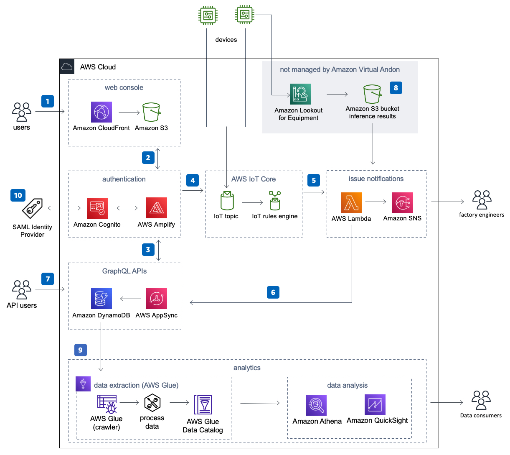

# Amazon Virtual Andon
Amazon Virtual Andon is a self-service, cloud based andon system that makes it easy for
any business to deploy andon in their factory. It is based on the same technology used
by the Amazon Fulfillment centers built on AWS.

The events occurring on the factory floor are captured either using a web-interface or connecting the machines to AWS IoT core that publish the events to a topic. These events are then stored in DynamoDB. Using the IoT Rule Engine, the events are integrated with other AWS services such as SNS to send notifications about the events.

The solution comes with 4 different user personas, Admin, Manager, Engineer and Associate.

For more information and a detailed deployment guide visit the Amazon Virtual Andon solution at https://aws.amazon.com/solutions/implementations/amazon-virtual-andon/.

## Architecture Overview

Please refer to our [documentation](https://docs.aws.amazon.com/solutions/latest/amazon-virtual-andon/architecture-overview.html) for more details on the architecture.

## Running unit tests for customization
* Clone the repository, then make the desired code changes
* Next, run unit tests to make sure added customization passes the tests
```bash
cd ./deployment
chmod +x ./run-unit-tests.sh
./run-unit-tests.sh
```

## Building distributable for customization
* Configure the bucket name of your target Amazon S3 distribution bucket
```
export REGION=aws-region-code # the AWS region to launch the solution (e.g. us-east-1)
export DIST_OUTPUT_BUCKET=bucket-name-prefix # prefix for the bucket where customized code will reside
export SOLUTION_NAME=amazon-virtual-andon
export VERSION=my-version # version number for the customized code
```
_Note:_ You would have to create an S3 bucket with the name `<bucket-name-prefix>-<aws_region>`. We recommend using a randomized value for `bucket-name-prefix`. `aws_region` is where you are testing the customized solution. We also recommend that you ensure this bucket is not public.

* Now build the distributable:
```bash
chmod +x ./build-s3-dist.sh
./build-s3-dist.sh $DIST_OUTPUT_BUCKET $SOLUTION_NAME $VERSION
```

* Deploy the distributable to an Amazon S3 bucket in your account. _Note:_ you must have the AWS Command Line Interface installed.
```bash
aws s3 cp ./regional-s3-assets/ s3://$DIST_OUTPUT_BUCKET-$REGION/$SOLUTION_NAME/$VERSION/ --recursive --acl bucket-owner-full-control --profile aws-cred-profile-name
```

* Get the link of the amazon-virtual-andon.template uploaded to your Amazon S3 bucket.
* Deploy the Amazon Virtual Andon solution to your account by launching a new AWS CloudFormation stack using the link of the amazon-virtual-andon.template.

## Collection of operational metrics
This solution collects anonymous operational metrics to help AWS improve the
quality of features of the solution. For more information, including how to disable
this capability, please see the [implementation guide](https://docs.aws.amazon.com/solutions/latest/amazon-virtual-andon/collection-of-operational-metrics.html).

***

Copyright 2021 Amazon.com, Inc. or its affiliates. All Rights Reserved.

Licensed under the Apache License, Version 2.0 (the "License");
you may not use this file except in compliance with the License.
You may obtain a copy of the License at

    http://www.apache.org/licenses/LICENSE-2.0

Unless required by applicable law or agreed to in writing, software
distributed under the License is distributed on an "AS IS" BASIS,
WITHOUT WARRANTIES OR CONDITIONS OF ANY KIND, either express or implied.
See the License for the specific language governing permissions and
limitations under the License.

## Deploying using cloudformation command

```bash
aws cloudformation create-stack \
   --profile ${AWS_PROFILE:-default} \
   --region ${REGION} \
   --template-url https://${DIST_BUCKET_PREFIX}-${REGION}.s3.amazonaws.com/${SOLUTION_NAME}/${VERSION}/amazon-virtual-andon.template \
   --stack-name AmazonVirtualAndon \
   --capabilities CAPABILITY_IAM CAPABILITY_NAMED_IAM CAPABILITY_AUTO_EXPAND \
   --parameters \
        ParameterKey=AdministratorEmail,ParameterValue=(email)
```